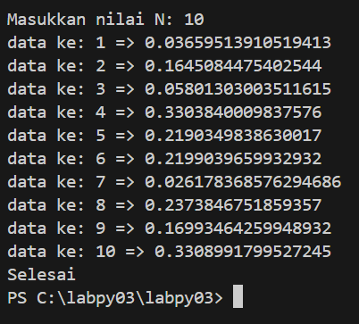

# Latihan Program Python
Repository ini berisi tentang dua buah kode program yang berfungsi untuk men-generate angka random dan tentang perhitungan profit dari investasi.

## Programs
Random Number Generator (tugaslatihan1.py)
Sebuah program yang akan menggenerate angka random kurang dari 0.5 berdasarkan input user.

